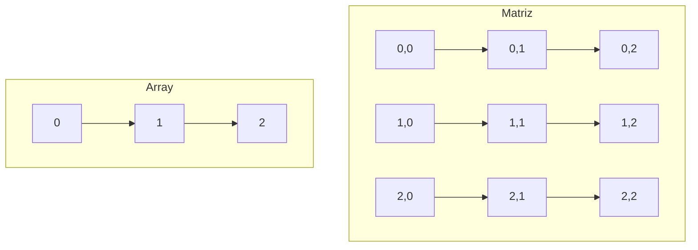

# Arrays

## 1. Introdução

Os arrays são estruturas de dados essenciais usadas para armazenar e organizar coleções de elementos de forma sequencial. Cada elemento é identificado por um índice, que representa sua posição dentro da estrutura, começando geralmente do índice 0.

Um array ocupa um espaço contínuo de memória, onde os elementos são armazenados lado a lado, facilitando o acesso direto e eficiente.

Representação:

```bash
[0000 1111 0000 1111]
```

Essa organização linear torna os arrays uma escolha popular em várias aplicações, como algoritmos de ordenação, busca e processamento de grandes volumes de dados.

Vantagens dos Arrays:

- Acesso rápido: É possível acessar qualquer elemento diretamente pelo índice.
- Simplicidade: Estrutura simples e eficiente para armazenar dados sequenciais.
- Compatibilidade: Amplamente suportados em diversas linguagens de programação.

!!! tip "Dica"
    Os arrays são uma das primeiras estruturas de dados que programadores aprendem. Eles são extremamente úteis e podem ser usados como base para implementar outras estruturas de dados, como pilhas, filas e listas.

## 2. Objetivo

Este documento tem como objetivo apresentar uma descrição detalhada sobre arrays, incluindo suas características, tipos, operações comuns e aplicações práticas. Além disso, oferecerá diretrizes para sua implementação e uso eficiente em diferentes linguagens de programação.

## 3. Público-alvo

Este material destina-se a:

- Estudantes de computação que desejam entender os fundamentos das estruturas de dados.
- Desenvolvedores iniciantes buscando melhorar suas habilidades em manipulação de arrays.
- Profissionais que necessitam de um guia rápido e estruturado sobre arrays para referência em seus projetos.

## 4. Conteúdo

### 4.1 Definição e Características

- **Tamanho fixo**: Arrays possuem um tamanho definido no momento de sua criação.
- **Acesso rápido**: Acesso a elementos via índice em tempo constante (O(1)).
- **Homogeneidade**: Armazenam elementos do mesmo tipo.

!!! info
    Em linguagens dinâmicas como Python, arrays podem ser substituídos por listas, que permitem armazenar elementos de diferentes tipos. No entanto, isso não é possível em linguagens estáticas como C++ ou Java.

### 4.2 Tipos de Arrays

#### 4.2.1.Unidimensionais (Vetores)

Armazenam elementos em uma única linha.

Exemplo em Python:

```python
vetor = [1, 2, 3, 4, 5]
```

#### 4.2.2. Multidimensionais (Matrizes)

Organizam elementos em múltiplas linhas e colunas.

Exemplo em Python:

```python
matriz = [[1, 2, 3], [4, 5, 6], [7, 8, 9]]
```

!!! tip "Dica"
    Matrizes são particularmente úteis em aplicações como processamento de imagens, onde cada pixel pode ser representado por uma célula na matriz.

#### 4.2.3. Dinâmicos

Podem crescer ou reduzir de tamanho durante a execução do programa.

Exemplo em Java (ArrayList):

```java
import java.util.ArrayList;
ArrayList<Integer> lista = new ArrayList<>();
lista.add(10);
lista.add(20);
```

### 4.3 Operações Comuns

#### 4.3.1. Criação

Definir arrays com tamanho fixo ou dinâmico.

```python
# Vetor com 5 elementos inicializados com 0
vetor = [0] * 5
```

#### 4.3.2. Acesso

Recuperar elementos de um array utilizando o índice.

```python
primeiro_elemento = vetor[0]  # Acessa o primeiro elemento
```

!!! warning "Atenção"
    Sempre verifique os limites do array antes de acessar um índice. Tentar acessar um índice fora do intervalo lançará um erro em muitas linguagens.

#### 4.3.3. Atualização

Modificar elementos existentes no array.

```python
vetor[0] = 10  # Atualiza o primeiro elemento para 10
```

#### 4.3.4. Percorrer

Iterar sobre os elementos de um array.

```python
for elemento in vetor:
    print(elemento)
```

#### 4.3.5. Ordenação

Organizar os elementos do array em ordem crescente ou decrescente.

```python
vetor.sort()  # Ordenação crescente
```

#### 4.3.6. Pesquisa

Buscar por um elemento no array.

```python
existe = 10 in vetor  # Verifica se o valor 10 está presente
```

!!! tip "Dica"
    Para grandes conjuntos de dados, considere usar algoritmos de pesquisa eficientes, como a pesquisa binária.

### 4.4. Aplicações Práticas

- Algoritmos de ordenação e pesquisa (e.g., Bubble Sort, Binary Search).
- Armazenamento de dados temporários em aplicações de processamento.
- Representação de tabelas e grades em jogos e aplicações gráficas.

!!! info
    Uma aplicação comum de arrays é na implementação de filas e pilhas, que são estruturas de dados derivadas.

## 5. Guia de Uso

### Linguagens com Suporte a Arrays

- **Python:**

  ```python
  vetor = [1, 2, 3]
  ```

- **Java:**

  ```java
  int[] vetor = new int[5];
  ```

- **C++:**

  ```cpp
  int vetor[5];
  ```

- **JavaScript:**

  ```javascript
  let vetor = [1, 2, 3];
  ```

!!! warning "Atenção"
    Em JavaScript, arrays podem conter elementos de tipos diferentes, o que pode levar a bugs se não for usado com cuidado.

### Melhores Práticas

- Sempre inicialize arrays antes de usar.
- Escolha entre arrays estáticos e dinâmicos conforme a necessidade do projeto.
- Use estruturas especializadas como listas vinculadas ou conjuntos quando a flexibilidade ou exclusividade forem necessárias.

!!! tip "Dica"
    Para arrays grandes, avalie o uso de bibliotecas otimizadas, como NumPy em Python, que oferece suporte a operações vetorizadas e maior eficiência.

## 6. Referências

- Thomas H. Cormen et al., "Introduction to Algorithms", MIT Press.
- Documentação oficial de linguagens de programação: [Python](https://docs.python.org), [Java](https://docs.oracle.com/en/java/), [C++](https://cplusplus.com/).

## 7. Anexos

### 7.1. Exemplo de Representação Gráfica


